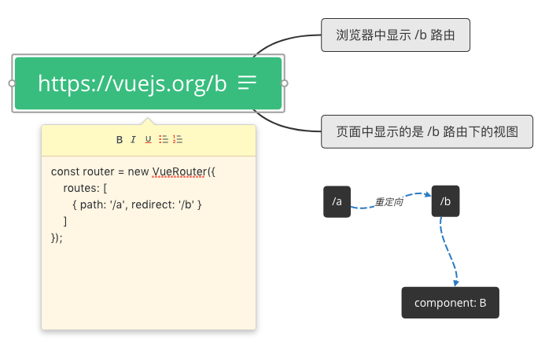
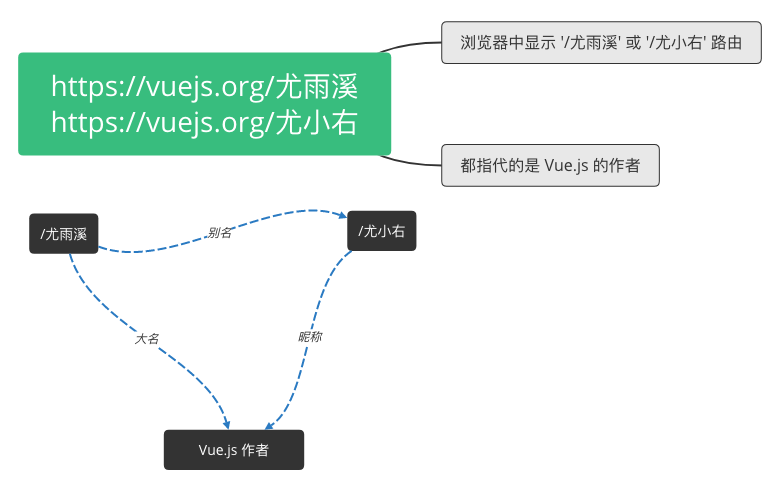

# 重定向和别名

## 什么是路由重定向？

如果你给 `/a` 路由设置了重定向路由 `/b`，那么当你访问 `/a` 时，Vue Router 会将 `/b` 路由下的视图展示出来，将 `/a` 重定向至 `/b`，重定向也是通过 routes 配置来完成。

```javascript
// 重定向至具体的路由
const router = new VueRouter({
  routes: [
    { path: '/a', redirect: '/b' },
  ],
});

// 重定向至命名路由
const router = new VueRouter({
  routes: [
    { path: '/a', redirect: { name: 'foo' } },
  ],
});

// 重定向并带有参数
const router = new VueRouter({
  routes: [
    { 
      path: '/redirect-with-params/:id', 
      redirect: '/with-params/:id',
    },
  ],
});

// 匹配所有路径并全部重定向至某个路由
const router = new VueRouter({
  routes: [
    { path: '*', redirect: '/' },
    // 如果将根路由命名为 index，那么还可以这样
    { path: '*', redirect: { name: 'index' } }，
    // 通常情况下，捕获所有路径的这种操作是在前面的所有路由都不匹配的情况下才会匹配到
    // 这种路由模式一般会作为 404 not found 页面的路由，或者直接重定向至首页也可以
    // 根据路由的优先级，这种 '*' 路由会放在路由配置的最后面
    { path: '*', redirect: { name: 'not-found' } },
  ],
});

// 可以是一个方法，动态返回重定向目标，可参照官网例子
// 根据你想要跳转的的目标路由(to)返回一个重定向路由
// 没有把重定向的目标路由写死，相当于一个路由可以重定向至多个路由
const router = new VueRouter({
  routes: [
    {
      path: '/a', 
      redirect: to => {
        const { hash, params, query } = to；
        if (query.to === 'foo') {
          return { path: '/foo', query: null };
        } 
        if (hash === '#baz') { 
          return { name: 'baz', hash: '' };
        }
        if (params.id) { 
          return '/with-params/:id';
        } else { 
          return '/bar' };
        }
    },
  ],
});
```


值得注意的是路由导航守卫 **`beforeEach`**、**`beforeLeave`** 不会应用在跳转路由上，而会**应用到目标路由**上。上述第一个例子中，为 `/a` 路由设置导航守卫将会失效（因为 `/a` 是跳转路由），正确的做法是为 `/b` 路由设置导航守卫。



当我们使用动态路由时，若想要在路由匹配成功时，显示其下的某个子路由视图，可以使用**重定向**或**空路由**，代码如下：

```javascript
const routes = [
  {
    name: 'user',
    path: '/user:/id',
    component: User,
    redirect: {
      name: 'profile', // 当访问 '/user/123' 时，将会重定向至 '/user/123/profile'，显示 Profile 视图
    },
    children: [
      {
        // 空路由，当以 '/user/123' 访问时，默认显示 Profile 视图
        // 当前路由显示
        path: '',
        component: Profile,
      },
      {
        name: 'profile',
        path: 'profile',
        component: Profile,
      },
      {
        name: 'emails',
        path: 'emails',
        component: Emails,
    ],
  },
];
```

**重定向**和**空路由**两者择一即可。推荐重定向，因为根据当前浏览器地址栏能更清晰的表现出当前的路由。**使用重定向或空路由时，当前路由的 params 不会丢失**。


## 什么是路由别名？

顾名思义，尤雨溪大家也称作尤小右、尤大等，这三个名称都指代的是 Vue.js 的作者。路由别名同样也是，路由别名的配置也是在 routes 中：

```javascript
const router = new VueRouter({
  routes: [
    {
      path: '/home', component: Home,
      children: {
        // absolute alias 
        { path: 'foo', component: Foo, alias: '/foo' },
        // relative alias (alias to /home/bar-alias) 
        { path: 'bar', component: Bar, alias: 'bar-alias' },
        // multiple aliases
        { path: 'baz', component: Baz, alias: ['/baz', 'baz-alias'] },
      },
  ],
})
```

## 有什么区别？

重定向将 `/a` 路由指向 `/b`，无论 `/a` 路由下有没有视图（组件），页面中的视图容器\(`<router-view>`\)都不会显示，而是会显示 `/b` 下的视图（组件）。同时浏览器的地址栏显示的是目标路由的路径 `/b`，而不会显示 `/a`。一个比较形象的图例如下：



路由别名是指， 如果 `/b` 是 `/a` 的别名，那么 `/a` 和 `/b` 都可以显示到浏览器的地址栏，但是页面中的视图容器\(`<router-view>`）都显示同一个视图（组件），所以无论以 `/a` 还是 `/b` 访问，效果都是一样的。一个较为形象的图例如下：



